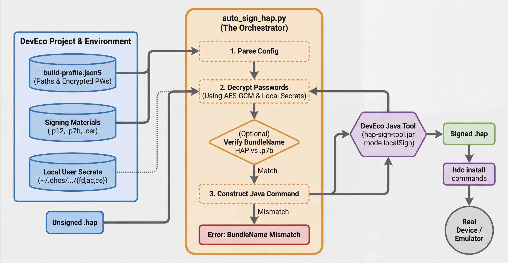

# Auto Sign HAP (DevEco 本地签名复刻)

`tools/auto_sign_hap.py` 用于给“未签名”的 `.hap` 包做**本地签名**，目标是让它能在开发/调试设备上安装运行（例如通过 `hdc install` 安装到真机）。

> 前提：你需要一套与该 HAP `bundleName` 匹配的签名材料（`.p7b/.p12/.cer`）。没有匹配的 profile，强行签名也大概率无法安装/运行。

## 示意图



## 原理

该脚本按 DevEco Studio / hvigor 的逻辑做了三件事：

1) **读取签名配置**
- 从 `build-profile.json5` 的 `app.signingConfigs[*].material` 读取签名材料路径：`profile(.p7b)`、`storeFile(.p12)`、`certpath(.cer)`，以及 `keyAlias/signAlg` 等。
- 如果你传的是模块级 `entry/build-profile.json5`（通常不含 `signingConfigs`），脚本会自动向上查找包含 `app.signingConfigs` 的项目根 `build-profile.json5`。

2) **解密 DevEco 存储的密码**
- DevEco 会把 `storePassword/keyPassword` 以加密 hex 字符串写在 `build-profile.json5`。
- 脚本复刻了 `hvigor-ohos-plugin` 的 `DecipherUtil` 机制，使用 `C:\Users\<you>\.ohos\config\material\{fd,ac,ce}` 中的材料解出真实密码（仅在本机本用户环境可解）。

3) **调用 DevEco 的签名工具对 HAP 签名**
- 使用 DevEco 自带的 `hap-sign-tool.jar` 执行 `sign-app -mode localSign`：
  - `-profileFile <xxx.p7b>`
  - `-keystoreFile <xxx.p12>` / `-keystorePwd <pwd>`
  - `-keyAlias <alias>` / `-keyPwd <pwd>`
  - `-appCertFile <xxx.cer>`
  - `-inFile <unsigned.hap>` / `-outFile <signed.hap>`

默认会校验：
- 从 HAP 内部 `module.json/module.json5/config.json` 解析 `bundleName`
- 用 `hap-sign-tool.jar verify-profile` 读取 `.p7b` 内的 `bundle-name`
- 两者一致才继续签名（可用 `--skip-bundle-check` 跳过）

## 环境要求

- Windows（脚本对本机 DevEco 默认安装路径做了探测）
- Python 3
- Python 包：`cryptography`（用于 AES-GCM 解密）
- 本机已安装 DevEco Studio，且存在 `hap-sign-tool.jar`
  - 默认路径：`D:\Huawei\DevEco Studio\sdk\default\openharmony\toolchains\lib\hap-sign-tool.jar`
- 已通过 DevEco 生成过签名材料（通常位于 `C:\Users\<you>\.ohos\config\`）

## 生成 `com.xxx` 的签名材料（DevEco）

签名材料的 `bundleName` 必须匹配目标 HAP 的 `bundleName`。推荐做法：

1) 在 DevEco 新建一个最简单的工程（Stage/ArkTS 均可）
2) 创建时把 `bundleName` 填为目标值（例如 `com.legado.app`）
3) 运行/构建一次，让 DevEco 自动生成并落盘签名材料
4) 在该工程根目录找到 `build-profile.json5`，里面会引用 `.p12/.p7b/.cer` 路径

## 用法

### 1) 基本签名

```powershell
python auto_sign_hap.py --hap C:\path\to\unsigned.hap
```

默认输出为同目录的 `*-signed.hap`。

### 2) 指定 build-profile（推荐：使用你为目标 bundleName 创建的工程）

```powershell
python auto_sign_hap.py `
  --hap C:\Users\32147\Downloads\Legado-V1.0.2.1-251130-unsigned.hap `
  --build-profile D:\Code\HapImage\LegadoSigner\build-profile.json5
```

如果你误传了模块级文件（例如 `...\entry\build-profile.json5`），脚本会自动向上寻找项目根的 `build-profile.json5`。

### 3) 指定 signingConfig / product

```powershell
python auto_sign_hap.py --hap C:\path\to\unsigned.hap --signing-config default
python auto_sign_hap.py --hap C:\path\to\unsigned.hap --product default
```

### 4) 跳过 bundleName 校验（不推荐）

```powershell
python auto_sign_hap.py --hap C:\path\to\unsigned.hap --skip-bundle-check
```

## 安装到真机

```powershell
hdc tconn 192.168.31.204:40289
hdc install -r C:\path\to\unsigned-signed.hap
```

如果之前安装过同 `bundleName` 但签名不同的版本，需要先卸载：

```powershell
hdc shell bm uninstall -n com.legado.app
```

## 常见问题

- `bundleName mismatch: hap=... profile=...`
  - 你的 `.p7b` profile 不属于该应用包名；请用 DevEco 按目标 `bundleName` 重新生成签名材料。

- `Unsupported command method` / `Can not find method {sign}`
  - 说明 `hap-sign-tool.jar` 的 CLI 不是旧的 `sign` 子命令；本工具使用的是 `sign-app`（DevEco 新版）。

- 设备安装失败（权限/签名校验失败）
  - 确认设备处于开发者模式且允许调试安装
  - 确认使用的 `.p7b` 与 HAP `bundleName` 匹配

## 安全提示

- `.p12`、`.p7b`、`.cer` 都属于签名材料，请勿提交到公共仓库或泄露给不可信方。
- 本脚本会在内存中解密 `storePassword/keyPassword` 并传给 `java -jar hap-sign-tool.jar` 执行；不要在不受信环境运行。


